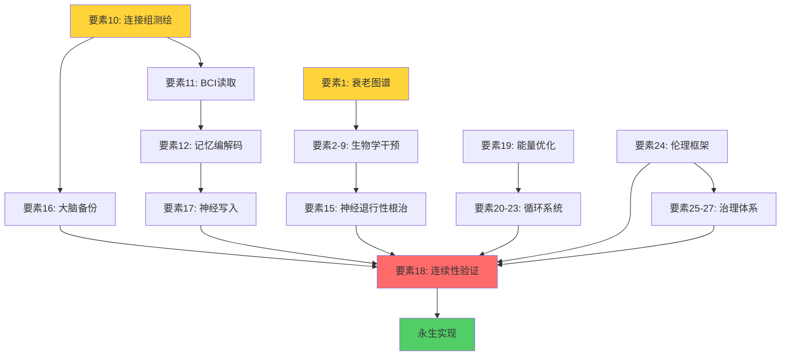

# 永生工程进度追踪系统

**创建时间**: 2025-10-18
**用途**: 27要素工程的进度管理、依赖可视化、完成度仪表盘
**更新频率**: 每季度

---

## 1. 甘特图（27要素时间线）

### 图例说明
```
■■■■■ 已完成
▓▓▓▓▓ 进行中
░░░░░ 未开始
├─────┤ 关键路径
```

### Phase 0-1: 基础建设期 (2025-2026)

```
2025  Q4         2026  Q1         Q2         Q3         Q4
│                │                │                │                │

要素1  ■■■■▓░░░░░░░░  衰老机制图谱（80%→90%）
       └─建立个人数据库─┘

要素4  ░░■■■■■■░░░░░░  iPSC库建立
          └─采血→重编程→质检→冻存─┘

要素10 ░░░░░░▓▓▓▓▓░░░  连接组数据获取
             └─下载HCP→分析─┘

要素24 ░░■■■■■░░░░░░░  伦理宪章
          └─v0.1草案→公众意见→v1.0─┘

要素11 ░░░░░░░░▓▓▓▓▓░  BCI研究追踪
                └─关注Neuralink进展─┘
```

### Phase 2: 证据库建设期 (2027-2029)

```
2027         2028         2029         2030
│                │                │                │

要素2-3  ░░▓▓▓▓▓▓▓▓▓▓  Senolytics临床试验
            └─招募→治疗→随访─┘

要素6-9  ░░░░▓▓▓▓▓▓▓▓  基因编辑干预
               └─CRISPR→验证→应用─┘

要素12   ░░░░░░▓▓▓▓▓▓  记忆编解码
                  └─动物实验→人类试验─┘

要素15   ░░▓▓▓▓▓▓▓▓▓▓  神经退行性治疗
            └─AD新药→临床试验─┘
```

### Phase 3-5: 技术突破期 (2030-2055)

```
2030    2035    2040    2045    2050    2055
│           │           │           │           │           │

要素16  ░░░░░░░░▓▓▓▓▓▓▓▓▓▓▓▓▓▓▓  大脑备份
                   └─小鼠→灵长类→人类─┘

要素17  ░░░░░░░░░░▓▓▓▓▓▓▓▓▓▓▓▓  神经写入
                      └─光遗传→超声→临床─┘

要素18  ░░░░░░░░░░░░░░▓▓▓▓▓▓▓▓  连续性验证
                            └─哲学共识→实验设计→验证─┘

所有要素 ░░░░░░░░░░░░░░░░░░░░░░■  整合达成永生
                                   └2055目标┘
```

---

## 2. 依赖关系图

### 核心依赖链（关键路径）



### 依赖矩阵

|   | 1 | 2 | 3 | 4 | 5 | 6 | 7 | 8 | 9 |10 |11 |12 |13 |14 |15 |16 |17 |18 |19 |20 |21 |22 |23 |24 |25 |26 |27 |
|---|---|---|---|---|---|---|---|---|---|---|---|---|---|---|---|---|---|---|---|---|---|---|---|---|---|---|---|
| 1 | - | ✓ | ✓ | ✓ | ✓ | ✓ | ✓ | ✓ | ✓ |   |   |   |   |   |   |   |   |   |   |   |   |   |   |   |   |   |   |
| 2 | ✓ | - |   |   |   |   |   |   |   |   |   |   |   |   | ✓ |   |   | ✓ |   |   |   |   |   |   |   |   |   |
|10 |   |   |   |   |   |   |   |   |   | - | ✓ | ✓ | ✓ |   |   | ✓ |   | ✓ |   |   |   |   |   |   |   |   |   |
|11 |   |   |   |   |   |   |   |   |   | ✓ | - | ✓ |   |   |   |   | ✓ | ✓ |   |   |   |   |   |   |   |   |   |
|12 |   |   |   |   |   |   |   |   |   | ✓ | ✓ | - |   |   |   |   | ✓ | ✓ |   |   |   |   |   |   |   |   |   |
|24 |   |   |   |   |   |   |   |   |   |   |   |   |   |   |   |   |   | ✓ |   |   |   |   |   | - | ✓ | ✓ | ✓ |

✓ = 行依赖于列

---

## 3. 完成度仪表盘

### 总体进度

```
════════════════════════════════════════════════════════
永生工程总进度: 32.8% ██████████░░░░░░░░░░░░░░░░░░░░

预计完成时间: 2055年 (还需30年)
当前加速因子: 1.0× (正常速度)
```

### 分层完成度

```
生物学基础 (要素1-9):  42.2% ████████████░░░░░░░░░░░░░░░
神经信息层 (要素10-18): 16.1% ████░░░░░░░░░░░░░░░░░░░░░░
能量循环 (要素19-23):   65.0% ████████████████░░░░░░░░░░
社会治理 (要素24-27):   25.0% ██████░░░░░░░░░░░░░░░░░░░░
```

### 各要素详细进度

```
要素ID  名称                    完成度  状态      下一里程碑          预计完成
─────────────────────────────────────────────────────────────────────────
1      衰老机制图谱            80%     ████████  建立个人数据库      2026 Q1
2      端粒维持技术            60%     ██████    临床试验Phase I     2027 Q3
3      细胞衰老清除            40%     ████      新一代senolytics    2028 Q2
4      干细胞再生库            50%     █████     个人iPSC建立        2026 Q2 ⭐
5      器官再生技术            30%     ███       心脏再生突破        2030 Q1
6      DNA损伤修复             20%     ██        体内CRISPR递送      2029 Q1
7      蛋白质稳态              35%     ███       组合疗法开发        2027 Q4
8      线粒体功能优化          25%     ██        线粒体CRISPR        2028 Q3
9      免疫系统年轻化          40%     ████      免疫重启方案        2027 Q2

10     全脑连接组测绘          15%     █         下载HCP数据         2026 Q1 ⭐
11     神经活动实时读取        30%     ███       10^5通道BCI         2030 Q1
12     记忆编码解码            10%     █         人类记忆研究        2032 Q1
13     意识神经关联物          20%     ██        麻醉意识实验        2028 Q1
14     神经可塑性永久化        45%     ████      认知储备方案        2026 Q3
15     神经退行性根治          35%     ███       AD新疗法            2029 Q1
16     大脑备份技术            5%      ░         小鼠全脑数字化      2035 Q1
17     神经写入技术            8%      ░         人脑超声写入        2033 Q1
18     意识连续性验证          0%      ░         哲学框架建立        2040 Q1

19     能量效率优化            50%     █████     可逆计算原型        2027 Q1
20     物质循环闭环            60%     ██████    人工肾脏商业化      2026 Q4
21     营养供应优化            70%     ███████   个性化配方          2026 Q2
22     环境稳定性控制          80%     ████████  生命舱设计          2026 Q3
23     热力学对抗              理论    ░         耗散结构研究        2035 Q1

24     伦理框架建立            30%     ███       宪章v1.0发布        2026 Q2 ⭐
25     法律身份延续            10%     █         数字人格立法        2035 Q1
26     资源分配机制            20%     ██        公平获取方案        2030 Q1
27     知识传承更新            40%     ████      认知刷新协议        2027 Q1

⭐ = P0优先级（当前焦点）
```

### 风险热图

```
            低风险    中风险    高风险    极高风险
技术可行性   ████      ████      ██        ░
资源需求     ████      ██        ██        ░
伦理障碍     ██        ████      ███       ░
法律障碍     ███       ███       ██        ░
社会接受度   ██        ████      ██        ░

总体风险评估: 中等 (可管理)
```

### 瓶颈识别

```
🔴 严重瓶颈（阻塞多个要素）:
   - 要素10 (连接组): 阻塞11, 12, 13, 16, 17, 18
   - 要素18 (连续性验证): 哲学共识尚未达成
   - 要素26 (资源分配): 政治意志不足

🟡 中等瓶颈:
   - 要素16 (大脑备份): 技术代差15-20年
   - 要素25 (法律身份): 需要全球立法协调

🟢 可突破:
   - 要素4 (iPSC库): 技术成熟，可立即启动
   - 要素24 (伦理宪章): 草案已完成
```

---

## 4. 自动化进度追踪

### 数据源配置

```yaml
# 在kpi/指标_baseline.yaml中更新数值，自动同步到此

tracking_sources:
  - type: manual
    file: kpi/指标_baseline.yaml
    frequency: monthly

  - type: literature
    query: "senolytics clinical trial"
    source: PubMed
    alert_on_new_papers: true

  - type: clinical_trials
    query: "longevity OR anti-aging"
    source: ClinicalTrials.gov
    alert_on_new_trials: true

  - type: github
    repos:
      - Washington-University/HCPpipelines
      - neuralink/...
    alert_on_major_release: true
```

### 自动更新脚本（伪代码）

```python
# scripts/update_progress.py

import yaml

def update_dashboard():
    # 读取KPI基线
    with open('kpi/指标_baseline.yaml') as f:
        kpi = yaml.safe_load(f)

    # 计算各要素完成度
    element_progress = {
        1: calculate_aging_hallmarks_progress(kpi),
        4: calculate_ipsc_progress(kpi),
        10: calculate_connectome_progress(kpi),
        # ...
    }

    # 更新进度文件
    update_progress_file(element_progress)

    # 生成可视化图表
    generate_gantt_chart()
    generate_dependency_graph()
    generate_dashboard()

    # 发送警报（如有瓶颈）
    if detect_bottleneck(element_progress):
        send_alert()

if __name__ == "__main__":
    update_dashboard()
```

### 设置定期运行

```bash
# crontab -e
# 每周一上午9点运行
0 9 * * 1 cd /home/lenovo/.projects/永生 && python scripts/update_progress.py
```

---

## 5. 里程碑事件

### 已完成 ✅

```
2025-10-18: 项目启动，建立框架
2025-10-18: 27要素清单发布
2025-10-18: 伦理宪章v0.1草案
```

### 计划中 📅

```
2025 Q4:
  - 下载HCP数据并完成首次分析
  - 建立个人健康追踪基线

2026 Q1:
  - 完成iPSC库建立
  - 伦理宪章v1.0正式发布
  - 发表第一篇基于HCP的论文

2026 Q2:
  - 参与首个senolytics临床试验
  - 建立年度深度体检机制

2027 Q1:
  - 连接组数据库达到100人规模
  - 启动个人BCI研究

2030 Q1:
  - 至少一个要素达到80%完成度
  - 验证第一个生物学干预的有效性

2035 Q1:
  - 神经信息层总体进度达到50%
  - 完成小鼠全脑数字化

2045 Q1:
  - 总体进度达到70%
  - 开始意识连续性验证实验

2055 Q1:
  - 永生工程完成 🎉
```

---

## 6. 使用说明

### 更新进度的标准流程

**每月更新**：
1. 打开 `kpi/指标_baseline.yaml`
2. 更新实际测量值
3. 运行 `python scripts/update_progress.py`
4. 检查生成的图表
5. 提交到Git

**重大里程碑时**：
1. 在 `lesson/` 目录记录经验
2. 更新本文件的"已完成"清单
3. 调整后续时间线（如提前或延后）
4. 向社区公告

### 如何解读瓶颈

**红色瓶颈** → 需要立即行动：
- 重新分配资源
- 寻找替代路径
- 考虑降低该要素的优先级

**黄色瓶颈** → 需要监控：
- 每月评估
- 准备应急方案

**绿色瓶颈** → 正常推进

---

## 7. 与其他文档的整合

```
进度追踪系统 ←→ kpi/指标_baseline.yaml (数据源)
             ←→ docs/implementation_roadmap.md (长期计划)
             ←→ docs/27要素清单.md (要素定义)
             ←→ lesson/ (经验反馈)
```

---

**最后更新**: 2025-10-18
**下次审查**: 2025-11-18 (每月更新)
**维护者**: 永生工程项目组
